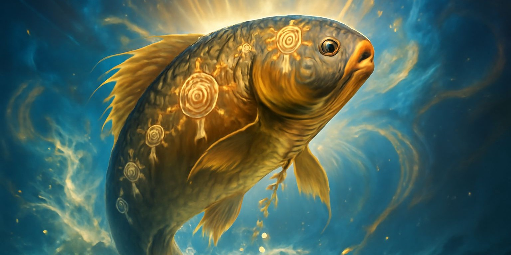
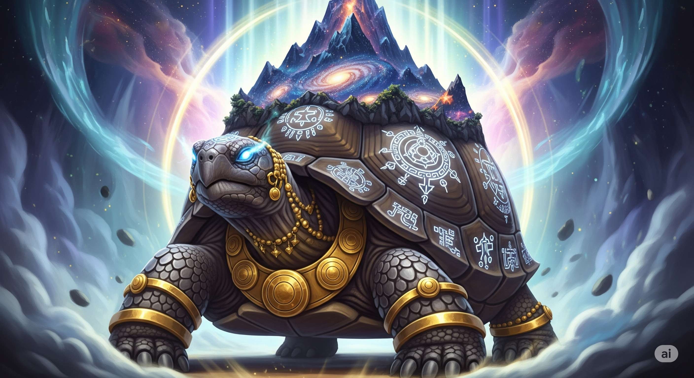
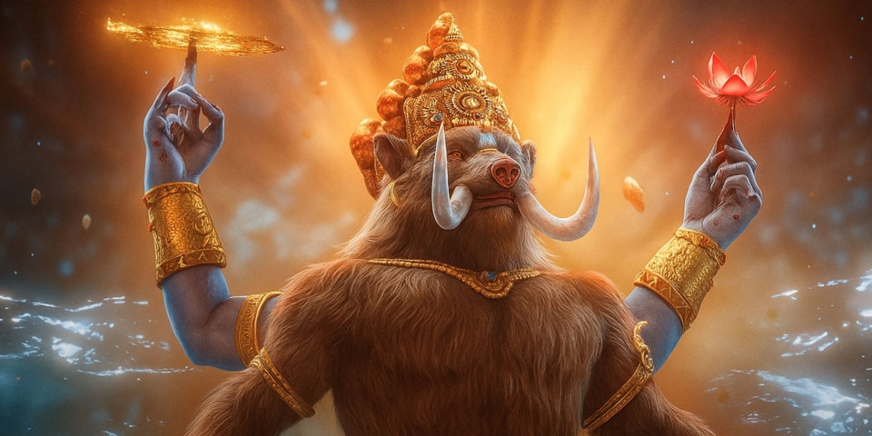
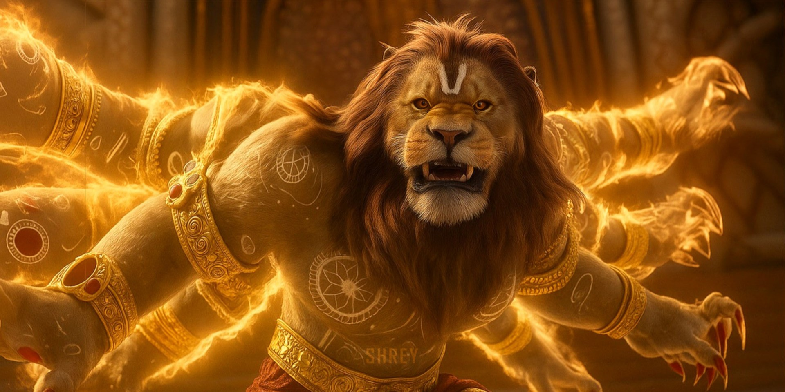
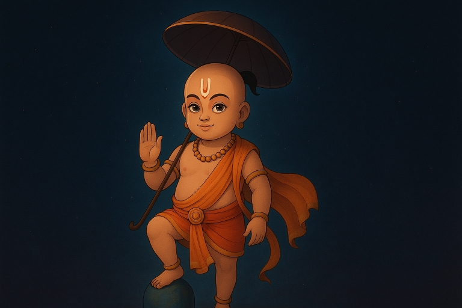
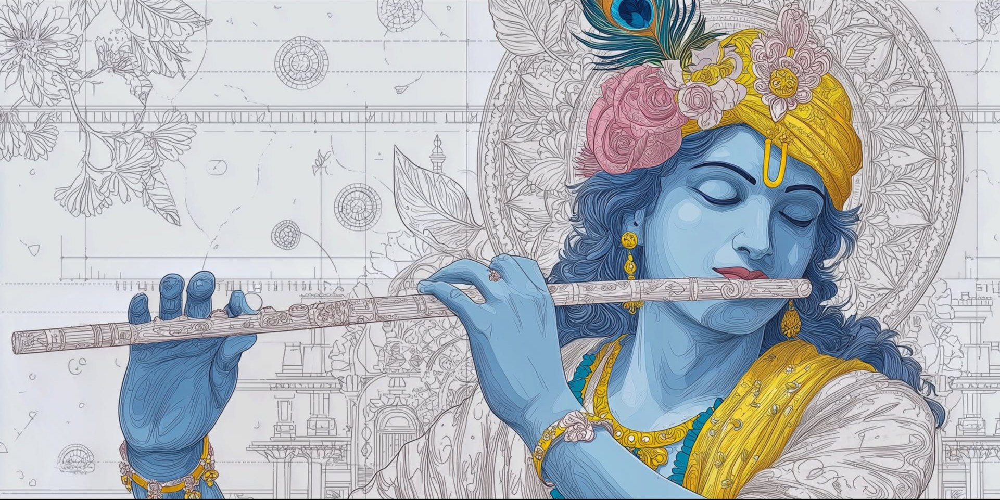
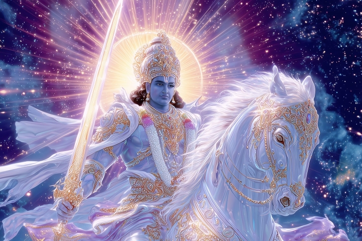

# 📖 Lord Vishnu – Dashavatara Project

An interactive, responsive web project dedicated to **Lord Vishnu’s 10 Avatars (Dashavatara)**.  
Each avatar page highlights the unique story, divine symbols, and essence of the incarnation with custom designs, while maintaining a unified theme through a global stylesheet.

---

## ✨ Features
- **Complete Dashavatara** → 10 Avatars (Matsya to Kalki), each with unique gradients, backgrounds, and thematic effects.  
- **Index Page** → Acts as the entry point with navigation to all avatars.  
- **Common Stylesheet** → `css/avatars.css` for shared design (typography, layout, symbols, header/footer).  
- **Unique Stylesheets** → Each avatar has its own `*-avatar.css` for backgrounds, animations, and visual identity.  
- **Navigation Buttons**  
  - `Next` → Move forward through avatars (in Dashavatara order)  
  - `Prev` → Go back to the previous avatar  
  - `Home` → Jump back to `index.html`  
  - `Up` → Scroll back to the top of the page  
- **Footer Section** → Draft footer added for About, Quick Links, and Contact (you can customize with your details).  
- **Responsiveness** → Layout adapts across mobile, tablet, and desktop.  
- **Accessibility** → Semantic HTML, optimized contrast, and scalable fonts.

---

## 📂 Project Structure
```
Lord Vishnu/
 ├── index.html                # Main landing page
 │
 ├── avatars/                  # Avatar pages + unique styles
 │    ├── matsya.html
 │    ├── kurma.html
 │    ├── varaha.html
 │    ├── narasimha.html
 │    ├── vamana.html
 │    ├── parashurama.html
 │    ├── rama.html
 │    ├── krishna.html
 │    ├── buddha.html
 │    ├── kalki.html
 │
 │    ├── matsya-avatar.css
 │    ├── kurma-avatar.css
 │    ├── varaha-avatar.css
 │    ├── narasimha-avatar.css
 │    ├── vamana-avatar.css
 │    ├── parashurama-avatar.css
 │    ├── rama-avatar.css
 │    ├── krishna-avatar.css
 │    ├── buddha-avatar.css
 │    ├── kalki-avatar.css
 │
 ├── css/
 │    └── avatars.css          # Common global stylesheet
```

---

## 🚀 How to Run
1. Clone or download this repository:  
   ```bash
   git clone https://github.com/your-username/lord-vishnu.git
   cd lord-vishnu
   ```

2. Open `index.html` in any browser.  
3. Use the navigation buttons (`Next`, `Prev`, `Home`, `Up`) to explore each avatar.  
4. Customize the footer with your own **About**, **Links**, and **Contact Info** if needed.

---

## 📖 Avatars Included

<table align="center">
  <tr>
    <td align="center" style="border:1px solid #ddd; padding:15px; background:#f9f9f9;">
      <b>1. Matsya – The Fish</b><br>
      (saves the Vedas from the flood)<br>
      
    </td>
    <td align="center" style="border:1px solid #ddd; padding:15px; background:#f9f9f9;">
      <b>2. Kurma – The Tortoise</b><br>
      (supports the churning of the ocean)<br>
      
    </td>
  </tr>
  <tr>
    <td align="center" style="border:1px solid #ddd; padding:15px; background:#f9f9f9;">
      <b>3. Varaha – The Boar</b><br>
      (rescues the Earth from Hiranyaksha)<br>
      
    </td>
    <td align="center" style="border:1px solid #ddd; padding:15px; background:#f9f9f9;">
      <b>4. Narasimha – The Man-Lion</b><br>
      (destroys Hiranyakashipu)<br>
      
    </td>
  </tr>
  <tr>
    <td align="center" style="border:1px solid #ddd; padding:15px; background:#f9f9f9;">
      <b>5. Vamana – The Dwarf</b><br>
      (restores cosmic order from Bali)<br>
      
    </td>
    <td align="center" style="border:1px solid #ddd; padding:15px; background:#f9f9f9;">
      <b>6. Parashurama – The Warrior</b><br>
      (destroys corrupt Kshatriyas)<br>
      
    </td>
  </tr>
  <tr>
    <td align="center" style="border:1px solid #ddd; padding:15px; background:#f9f9f9;">
      <b>7. Rama – The Prince of Ayodhya</b><br>
      (hero of the Ramayana)<br>
      
    </td>
    <td align="center" style="border:1px solid #ddd; padding:15px; background:#f9f9f9;">
      <b>8. Krishna – The Divine Statesman</b><br>
      (guide of the Mahabharata & Gita)<br>
      
    </td>
  </tr>
  <tr>
    <td align="center" style="border:1px solid #ddd; padding:15px; background:#f9f9f9;">
      <b>9. Buddha – The Enlightened One</b><br>
      (path of peace and non-violence)<br>
      
    </td>
    <td align="center" style="border:1px solid #ddd; padding:15px; background:#f9f9f9;">
      <b>10. Kalki – The Future Warrior</b><br>
      (to end the Kali Yuga)<br>
      
    </td>
  </tr>
</table>

---

## 🙏 Credits
- **Content**: Inspired by Hindu Scriptures (Dashavatara).  
- **Design & Development**: **Jitendra Verma**  
- **Frameworks/Tools**: Pure **HTML + CSS**, no external frameworks.  

---

## 📸 Future Enhancements
- Add images or illustrations for each avatar.  
- Implement light/dark mode toggle.  
- Add audio recitation of Sanskrit verses.  
- Deploy online (Firebase, Vercel, or GitHub Pages).

